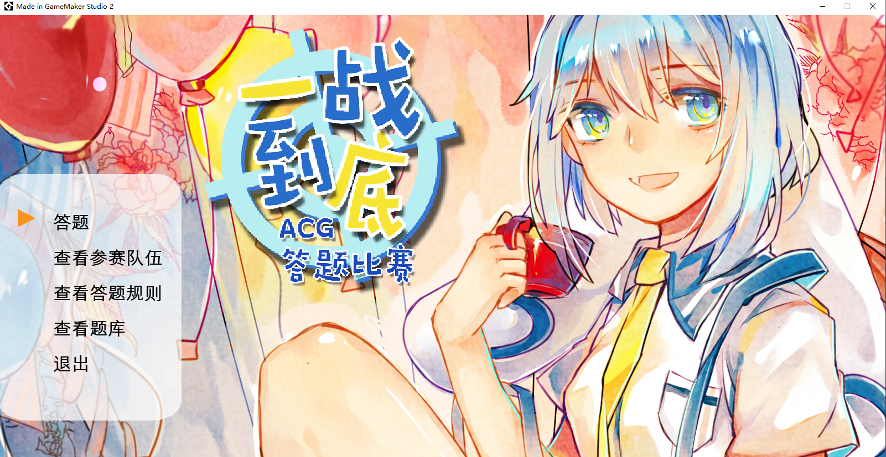
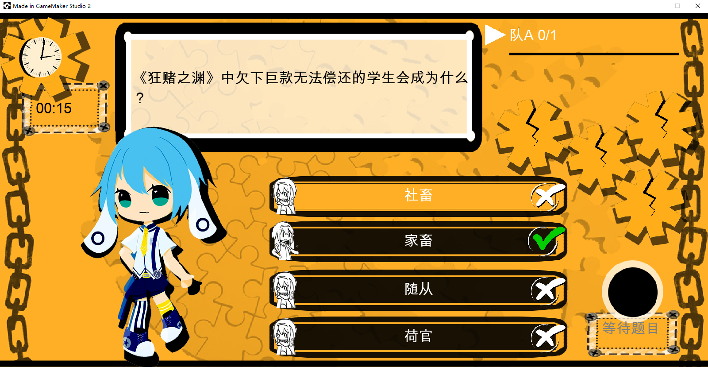

### 关于项目

用于ZACA动漫协会线下举办的“一站到底”答题比赛。

预赛：1支队伍参与，答10题。每题时限20s。

决赛：2支队伍参与，轮流各答一题，某一队累计答错3题时比赛结束。每题时限20s。

ban/pick：每支队伍可对若干题目子类进行ban/pick。ban的题目将降低出现概率，pick的题目将增加出现概率。

支持图片题和音频题。

### 关于配置文件

所有候选参赛队伍需录入在`参赛队伍.txt`，且修改后需要在程序里操作`主菜单>查看参赛队伍>清除当前队伍并导入队伍文件`；

`比赛规则.txt`可用于调整预赛/决赛规则中的数值，但不建议调整。`基本设置.txt`似乎无法生效，无需调整。

### 关于源码

为GMS工程。应该是GMS1时创建的，不确定GMS2是否能正常打开。且GMS2对于发布可执行文件好像更新了协议，不确定使用最新的GMS2否能将该源码工程打包出可执行文件。

### 关于release

GMS1时打包。

无鼠标操作。键盘上下左右，`Z键`确认，`X键`取消。

如遇到音频题，需要点击右下角音乐图标开始播放，且一定要等首次播放结束才能选择答题选项。

决赛时每个队伍可以使用有限次的4种技能：跳过本题、排除两个错误选项、请教观众、请教专家团。